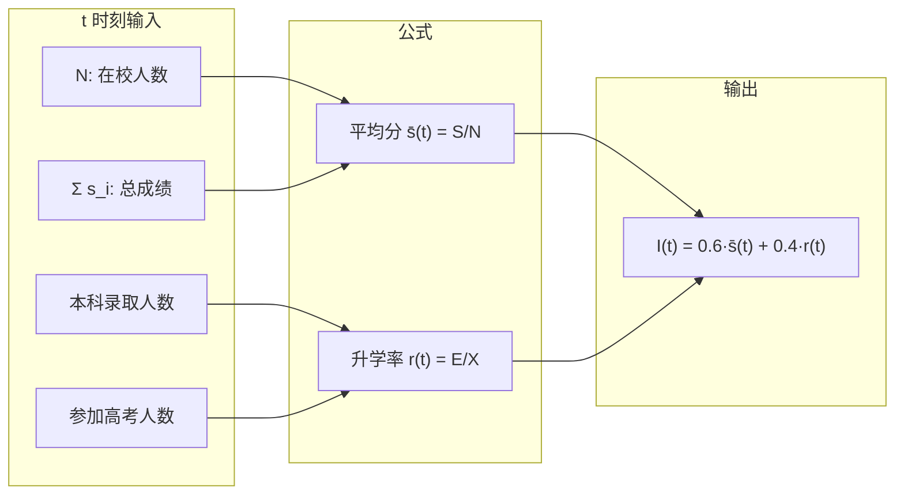
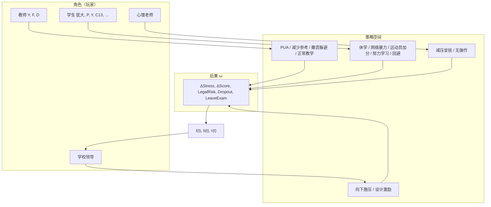
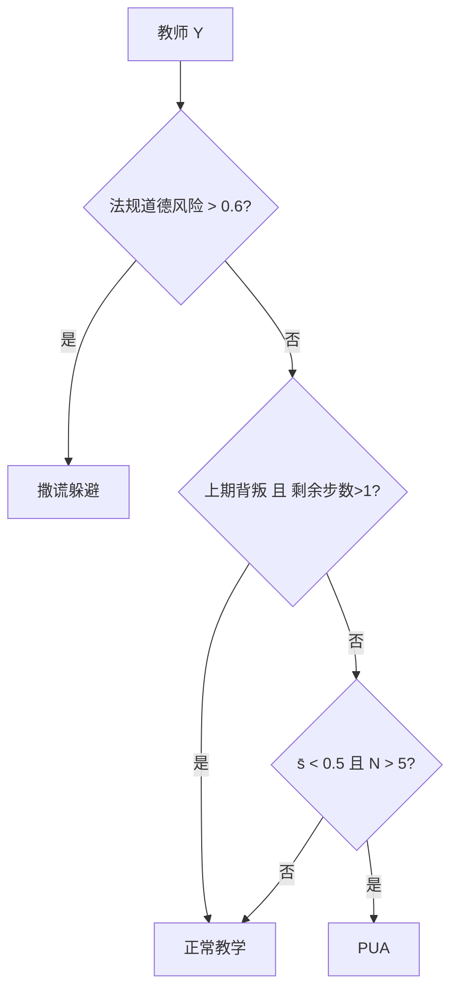
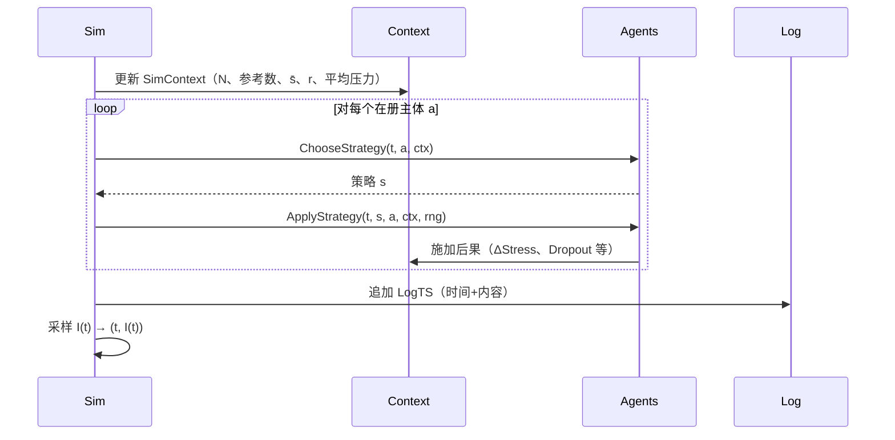
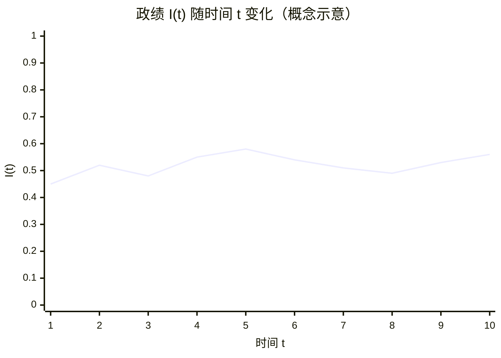
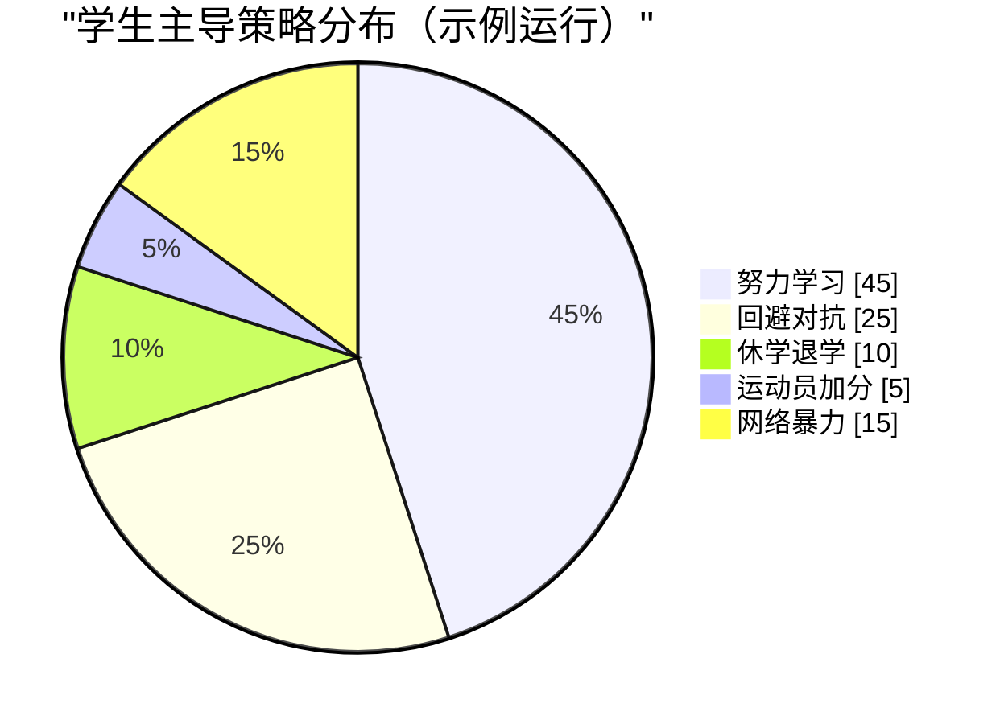

# 教育行政化体系下的多主体博弈与时间激励函数：基于重复博弈与时序仿真的形式化研究

## 摘要

本文在教育行政化制度背景下，将学校组织抽象为多主体博弈框架：教师、学生、心理教师与学校领导作为理性主体，在政绩量化指标（学生平均成绩与本科升学率）驱动下选择策略。我们引入时间作为第一维度的时序元编程模型，定义量化因子（家庭背景、智力、情绪智力、PUA 暴露/抵抗力、法规道德风险），建立角色—策略—后果的映射，并给出领导层时间激励函数 $I(t) = 0.6 \cdot \bar{s}(t) + 0.4 \cdot r(t)$。通过重复博弈扩展（历史依赖与终局效应），在 Go 语言实现中完成时序仿真。结果表明：教师在高法规风险下选择「撒谎躲避」，在低政绩下选择 PUA 或减少高考参考人数；学生根据净 PUA 压力与上期教师背叛与否在努力学习、回避对抗与休学之间切换；领导在政绩低于阈值时向下施压（踢猫效应）。仿真输出时间序列日志与激励采样，为政策风险与激励设计提供可计算参考。

**关键词**：教育行政化；多主体博弈；重复博弈；时间激励函数；踢猫效应；时序仿真

---

## 1. 引言

### 1.1 背景与动机

教育行政化体系下，学校政绩常以学生平均成绩与本科升学率等可观测指标量化。该激励结构将「人类决策」转化为可计算的变量，进而影响教师与学生的策略选择，并可能引发 PUA 施压减员、减少高考参考人数、休学退学、网络暴力等行为，形成典型的**多主体、多期、不完全信息**博弈。为分析不同决策产生的政策风险与均衡结果，并为学校领导设计合理的时间激励函数，需要建立形式化的博弈论模型与可执行的仿真实现。

### 1.2 相关概念

- **教育行政化**：学生对教师负责，教师受校长管理，校长对学校负责；政绩以学生平均成绩与本科升学率量化。
- **踢猫效应（Kick the cat）**：层级中较高位阶者将挫折向下转移，形成连锁反应；在模型中体现为领导政绩不佳时向下施压、教师向学生施压。

### 1.3 贡献与结构

本文的主要贡献：（1）将教育行政化场景形式化为多角色、多策略的扩展式/重复博弈；（2）提出「时间第一维度」的时序元编程规范，统一对象与函数的时间语义；（3）给出领导层时间激励函数的显式形式及仿真采样方法；（4）基于 Go 实现完整时序仿真，输出策略选择、后果与激励曲线。全文结构：§2 形式化模型，§3 博弈结构（角色、策略、支付），§4 均衡与策略逻辑，§5 仿真设计与实现，§6 结果与讨论，§7 结论。

---

## 2. 形式化模型

### 2.1 时间序列元编程规范

- **第一性原理**：时间是第一维度。时序对象的时间为第一成员，时序函数的时间为第一参数。
- **时序对象**：`Factor`（量化因子）、`Agent`（社会成员）、`SimState`（仿真状态）均以 `Birth` 或 `Current` 为第一成员。
- **时序函数**：  
  $$t \mapsto \text{Incentive}(t,\ldots),\quad \text{ChooseStrategy}(t,\ldots),\quad \text{ApplyStrategy}(t,\ldots)$$  
  等均以时间 $t$ 为第一参数。
- **时序日志**：事件记录为「时间 + 内容」格式（$\text{LogTS}$），满足时间序列日志规范。

### 2.2 量化因子

每个主体携带一个因子向量 $\mathbf{f}$，分量取值于 $[0,1]$（或标准分）：

| 因子 | 符号 | 含义 |
| :--- | :--- | :--- |
| 家庭背景 | $\text{FamilyBackground}$ | 0=极贫，1=极富；影响资源与升学路径 |
| 智力 | $\text{IQ}$ | 影响学业表现与策略理解 |
| 情绪智力 | $\text{EQ}$ | 影响抗压与踢猫链中的情绪传播 |
| PUA 暴露 | $\text{PUAExposure}$ | 教师 PUA 策略对该个体的暴露强度 |
| PUA 抵抗力 | $\text{PUAResistance}$ | 个体对 PUA 的抵抗力 |
| 法规道德风险 | $\text{LegalMoralRisk}$ | 个体/行为触发的法规与道德追责风险 |

**净 PUA 压力**：$\pi = \text{PUAExposure} \times (1 - \text{PUAResistance})$，用于驱动休学/回避等策略。

### 2.3 政绩与激励的量化公式

**公式 1 — 学生平均成绩：**

$$
\bar{s} = \frac{\sum_i s_i}{N}, \quad N = \text{在校学生人数}
$$

**公式 2 — 本科升学率：**

$$
r = \frac{\text{本科录取人数}}{\text{参加高考人数}} \times 100\%
$$

**时间激励函数**（领导层感知的政绩）：

$$
I(t) = 0.6 \cdot \bar{s}(t) + 0.4 \cdot r(t)
$$

其中 $\bar{s}(t)$、$r(t)$ 由 $t$ 时刻在校学生、参考人数与达线人数计算得到。领导层激励与教师收益同构：$I(t) = U_{\text{teacher}}(\bar{s}(t), r(t))$。

**学生收益**：学生收益为其在高考参考池时的预测高考成绩，否则为 0。预测高考成绩 $G = w_1 S_{t-3} + w_2 S_{t-2} + w_3 S_{t-1}$，取 $w_1=0.2$、$w_2=0.3$、$w_3=0.5$（近期权重更大）；见 `incentive.go` 中的 `GaokaoScore` 与 `StudentPayoff`。

#### 激励公式数据流（GFM 图）

---

## 3. 博弈结构：角色、策略与支付

### 3.1 角色（玩家）与类型

| 角色 | 激励依据 | 类型/特征 |
| :--- | :------- | :-------- |
| 教师 Y | 公式 1（平均分） | 可减少分母（PUA 减员）、应付审查（撒谎躲避） |
| 教师 F | 公式 1 + 公式 2 | 可减少高考参考人数、撒谎躲避 |
| 教师 D | 公式 1 + 公式 2 | 以平均成绩最大化为目标，但不采取剔除学生策略（无 PUA、无减少参考人数）；风险高则撒谎躲避，否则正常教学 |
| 学生犹大 | 攀附教师 F | 富裕中产，可发动网络暴力减员 |
| 学生黑曼巴 | 钞能力 | 不参与高考，策略集为空 |
| 学生 P | 低 IQ、高 PUA 暴露 | 休学消极对抗 |
| 学生 Y | 运动员加分 | 高 IQ 运动员；获取加分需学校领导同意 |
| 学生 C13 | 高 IQ 贫困 | 稳定选择努力学习 |
| 心理老师 | 系统平衡 | 减压安抚 |
| 学校领导 | $I(t)$ | 负责分配学校资源（如谁加分、谁休学退学）、安排心理老师定向辅导学生；政绩低→向下施压；政绩高→设计激励 |

### 3.2 策略空间

- **教师**：PUA 施压减员、减少高考参考人数、撒谎躲避监控、正常教学。
- **学生**：休学退学、网络暴力、运动员加分、努力学习、回避对抗。
- **心理老师**：减压安抚、无操作。
- **领导**：向下施压（踢猫）、设计激励函数。

### 3.3 多主体博弈结构（GFM 图）

### 3.4 后果（支付）结构

策略执行产生后果 $\omega$，包括：$\Delta\text{Stress}$、$\Delta\text{Score}$、$\text{LegalRisk}$、$\text{Dropout}$、$\text{LeaveExam}$ 等。例如：PUA 施压→目标学生压力上升、行为者法规风险上升；休学退学→本人离校且退出高考池；减压安抚→目标学生压力下降。支付通过 $\bar{s}(t)$、$r(t)$ 与 $I(t)$ 间接进入领导的效用，并经由 $\text{Stress}$、$\text{InSchool}$、$\text{InExamPool}$ 影响下一期状态与其余主体的策略。

---

## 4. 均衡与策略逻辑（重复博弈扩展）

### 4.1 信息与历史

- **重复博弈**：多期步进，每期先根据当前状态与**剩余步数**、**上期教师是否背叛**（PUA/减少参考人数）更新上下文，再全体同时选策略，最后统一施加后果。
- **历史依赖**：若上期教师背叛且剩余步数大于 1，教师本期可选择「正常教学」以恢复声誉；学生可在上期教师背叛时选择「网络暴力」或「回避对抗」。

### 4.2 策略选择逻辑（均衡对应）

- **教师 Y**：若 $\text{LegalMoralRisk} > 0.6$ → 撒谎躲避；若上期背叛且剩余步数 $>1$ → 正常教学；若 $\bar{s} < 0.5$ 且 $N > 5$ → PUA；否则正常教学。
- **教师 F**：若 $\text{LegalMoralRisk} > 0.5$ → 撒谎躲避；若上期背叛且剩余步数 $>1$ → 正常教学；若参考人数 $>3$ 且升学率 $<0.6$ → 减少高考参考人数；否则正常教学。
- **教师 D**：若 $\text{LegalMoralRisk} > 0.5$ → 撒谎躲避；否则正常教学（不采取 PUA、不减少参考人数；以平均成绩最大化且不剔除学生）。
- **学生犹大**：若 $N>4$、$\text{LegalMoralRisk}<0.5$，且（终局或上期教师背叛）→ 网络暴力；否则努力学习。
- **学生 P**：若净 PUA 压力 $\pi > 0.5$ 且 $\text{Stress} > 0.6$ → 休学；否则回避对抗。
- **普通学生**：高 $\pi$ 与高压力 → 休学；上期教师背叛且剩余步数 $>2$ → 回避对抗；否则按 IQ 在努力学习/回避对抗间选择。
- **心理老师**：若平均压力 $>0.4$ → 减压安抚。
- **领导**：负责分配资源（如本期选择「设计激励」即批准学生 Y 的运动员加分）、安排心理老师定向辅导学生。若 $I(t) < 0.5$ → 向下施压；否则设计激励函数。学生 Y 的运动员加分仅在本步领导选择设计激励时生效。

上述规则与实现中的 $\text{ChooseStrategy}(t, a, \text{ctx})$ 一致，可视为**行为策略**在离散状态与阈值下的均衡对应。

#### 策略决策流（教师 Y）

---

## 5. 仿真设计与实现

### 5.1 步进与阶段

- **步长**：按日（或可配置）推进；步数由时间区间 $[t_0, t_1]$ 与步长决定。
- **每步**：（1）根据当前在册成员更新 $\text{SimContext}$（学生数、参考数、升学率、平均压力等）；（2）对每个在册主体调用 $\text{ChooseStrategy}(t, a, \text{ctx})$；（3）对所得策略调用 $\text{ApplyStrategy}(t, s, a, \text{ctx}, \text{rng})$，将后果施加于行为者或随机目标学生；（4）追加时间序列日志 $\text{LogTS}$；（5）采样 $I(t)$ 得到 $(t, I(t))$ 点列。

### 5.2 仿真单步时序（GFM 图）

### 5.3 实现要点

- **代码结构**：`model.go`（时序对象）、`roles.go`（角色与策略枚举、Agent 构造）、`incentive.go`（$I(t)$）、`strategy.go`（$\text{ChooseStrategy}$、$\text{ApplyStrategy}$ 及后果量化）、`sim.go`（$\text{SimContext}$、$\text{Run}$、$\text{LogTS}$）、主入口构建各角色 Agent 并调用 $\text{Run}$。
- **输出**：时间序列日志（时间+内容）、激励采样序列（时间→政绩）、终态统计（在校人数、参考人数、本科录取数、平均成绩、升学率、政绩），以及按主导策略分组的学生统计与最佳策略建议。

---

## 6. 结果与讨论

### 6.1 激励曲线与政绩演化

$I(t)$ 随 $t$ 的采样序列构成「时间–政绩」曲线。政绩受平均成绩与升学率共同驱动；PUA 减员或减少参考人数在短期内可能提高 $\bar{s}$ 或 $r$，但会触发休学、退考与法规风险，长期可能降低在册人数与参考人数，需结合具体参数与随机种子分析。

#### 时间–政绩曲线（概念示意）

*上图为 $I(t)$ 的示例轨迹；当 $I(t) < 0.5$ 时领导选择「向下施压」（踢猫效应）。*

### 6.2 策略分组与最佳策略

仿真按学生主导策略（努力学习、回避对抗、休学退学、运动员加分、网络暴力）分组统计。典型结论：以「努力学习」或「回避对抗」为主导策略的学生组，平均成绩与留校率更优；休学退学组留校率为 0，多在高 PUA 暴露且高压力时被触发；与重复博弈中的「合作—背叛—报复」模式一致。

#### 策略分布示例（GFM 图）

### 6.3 政策含义与局限

- **政策含义**：激励函数权重（0.6/0.4）与阈值（如 $I(t)<0.5$ 触发向下施压）直接影响均衡行为；提高法规道德风险或降低 PUA 暴露可抑制减员与网络暴力；心理老师的减压策略有助于降低系统平均压力。
- **局限**：模型为简化多主体、离散策略与确定性阈值；未对不完全信息做贝叶斯刻画；真实数据校准与稳健性检验留待后续工作。

---

## 7. 结论

本文在教育行政化背景下建立了多主体、多策略、时间驱动的博弈模型，并将「时间第一维度」的时序元编程规范贯穿于对象与函数设计。通过重复博弈扩展（历史与终局依赖）和 Go 实现的时序仿真，得到了教师、学生、心理老师与领导的策略选择逻辑及激励函数 $I(t)$ 的演化。仿真结果支持「努力学习/回避对抗」在学生层面的相对优势，以及领导与教师在政绩与法规风险约束下的均衡行为。工作为政策风险分析与激励设计提供了可计算、可复现的形式化与实现基础。

---

## 参考文献

1. 踢貓效應. 维基百科. https://zh.wikipedia.org/wiki/%E8%B8%A2%E7%8C%AB%E6%95%88%E5%BA%94  
2. 项目文档与实现：`function/local/n/china/shantou/y/y.md`，`model.go`，`roles.go`，`incentive.go`，`strategy.go`，`sim.go`，主入口 `y.go`。
